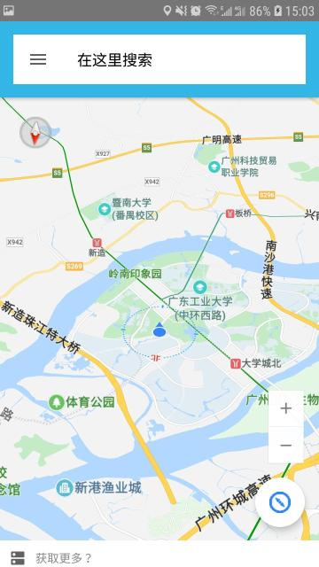
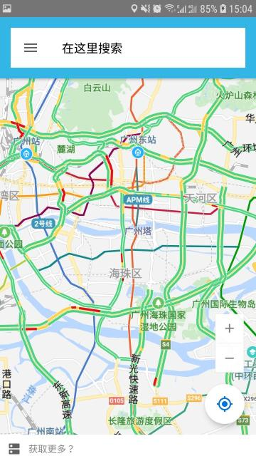
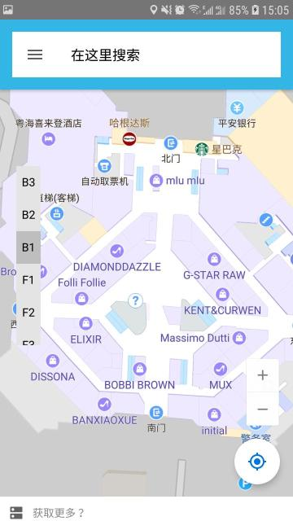

# MyMap
### Android平台上的一个地图查看软件
## 简介
#### 基于百度地图api，可以查看当前所在位置、城市热力图、交通图、卫星图、知名广场的室内图，并可以离线下载地图数据的安卓软件。

## 源代码结构

>	+ **app/assets**
存放程序中使用的图标
>	+ **app/libs**
存放需要依赖的环境包：BaiduLBS_Android.jar
>	+ **app/src/main/java/com/zhh/mymap/indoorview**
关于室内图的源代码文件夹
>	+ **app/src/main/java/com/zhh/mymap/map**
程序的主要代码以及离线下载代码文件夹
>	+ **app/src/main/java/com/zhh/mymap/mapapi**
图层（热力图、交通图、卫星图）的代码文件夹
>	+ **app/src/main/java/com/zhh/mymap/service**
定位服务代码文件夹
>	+ **app/src/main/java/com/zhh/mymap/Application.java**
程序的入口代码
>	+ **app/src/main/jniLibs**
依赖库
>	+ **app/src/main/res**
程序资源文件

## **环境**
* gradle 4.6
* Android Studio 3.2

### <u>请在程序运行前授予所有权限，否则可能无法正常使用！</u>

## 程序部分截图

